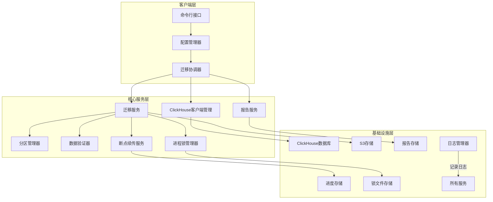
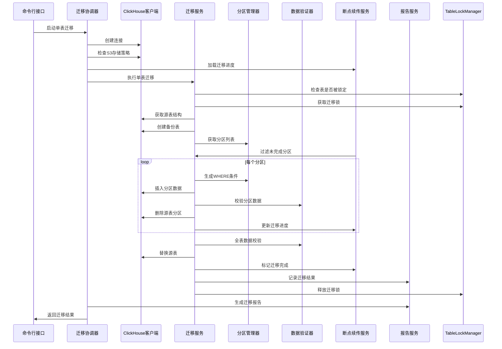
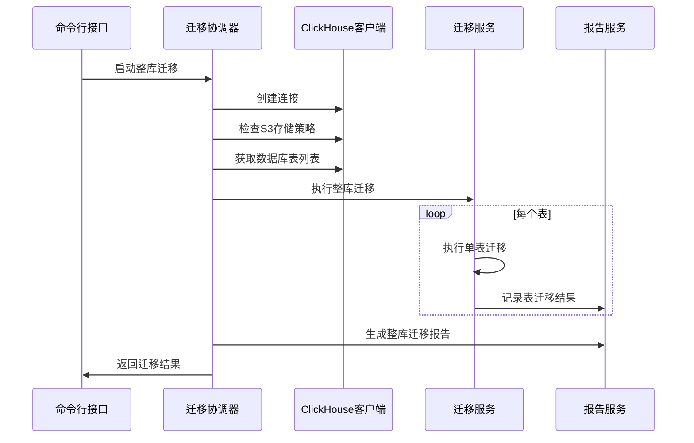

# ClickHouse S3 迁移系统架构设计

## 1. 系统概述

本架构设计基于现有的 `ClickhouseMigratorS3.py` 脚本，将其重构为一个模块化、可维护的迁移系统，保持所有现有功能不变。系统的核心目标是提供一个可靠、高效的工具，将 ClickHouse 表从本地存储策略迁移到 S3 存储策略。

## 2. 架构设计原则

- **模块化设计**：将功能拆分为独立的模块，便于维护和扩展
- **单一职责**：每个模块只负责一个特定的功能领域
- **可测试性**：设计便于单元测试和集成测试的组件
- **可配置性**：支持通过配置文件和环境变量进行配置
- **可观测性**：提供详细的日志和监控指标
- **向后兼容**：保持与原有脚本相同的命令行接口和功能

## 3. 系统架构图



## 4. 模块设计

### 4.1 客户端层

#### 4.1.1 命令行接口 (CLI)
- **功能**：解析命令行参数，启动迁移流程
- **实现**：`clickhouse_migrator/cli.py`
- **关键参数**：
  - `--mode`：迁移模式（single/full）
  - `--db`：目标数据库名
  - `--table`：单表迁移时指定表名
  - `--host`：ClickHouse 主机地址
  - `--port`：ClickHouse HTTP 端口
  - `--user`：ClickHouse 用户名
  - `--password`：ClickHouse 密码
  - `--s3-policy`：S3 存储策略名
  - `--insert-interval`：分区插入间隔
  - `--resume`：启用断点续传
  - `--log-path`：日志存储路径
  - `--report-path`：迁移报告存储路径

#### 4.1.2 配置管理器
- **功能**：管理系统配置，支持命令行参数、配置文件和环境变量
- **实现**：`clickhouse_migrator/config.py`
- **配置源优先级**：命令行参数 > 环境变量 > 配置文件

### 4.2 核心服务层

#### 4.2.1 迁移协调器
- **功能**：协调各个服务的执行，管理迁移流程
- **实现**：`clickhouse_migrator/orchestrator.py`
- **核心流程**：
  1. 初始化配置和日志
  2. 创建 ClickHouse 客户端
  3. 检查 S3 存储策略
  4. 加载断点续传进度
  5. 执行迁移（单表或整库）
  6. 生成迁移报告
  7. 检查迁移结果

#### 4.2.2 ClickHouse 客户端管理
- **功能**：创建和管理 ClickHouse 客户端连接
- **实现**：`clickhouse_migrator/clients/ch_client.py`
- **核心功能**：
  - 客户端连接池管理
  - 连接健康检查
  - 统一的错误处理

#### 4.2.3 迁移服务
- **功能**：执行具体的迁移逻辑
- **实现**：`clickhouse_migrator/services/migration.py`
- **核心功能**：
  - 单表迁移
  - 整库迁移
  - 表结构管理

#### 4.2.4 分区管理器
- **功能**：管理表的分区信息
- **实现**：`clickhouse_migrator/services/partition.py`
- **核心功能**：
  - 获取分区列表
  - 生成分区 WHERE 条件
  - 格式化分区值

#### 4.2.5 数据验证器
- **功能**：验证数据一致性
- **实现**：`clickhouse_migrator/services/validator.py`
- **核心功能**：
  - 分区级数据校验
  - 全表级数据校验
  - 校验报告生成

#### 4.2.6 断点续传服务
- **功能**：管理迁移进度，支持断点续传
- **实现**：`clickhouse_migrator/services/resume.py`
- **核心功能**：
  - 进度文件管理
  - 未完成分区识别
  - 进度更新

#### 4.2.7 报告服务
- **功能**：生成迁移报告
- **实现**：`clickhouse_migrator/services/report.py`
- **核心功能**：
  - 迁移结果收集
  - 报告生成（JSON 格式）
  - 报告存储

#### 4.2.8 进程锁管理器
- **功能**：管理表迁移的进程锁，防止并发操作
- **实现**：`clickhouse_migrator/utils/lock.py`
- **核心功能**：
  - 表级锁的获取和释放
  - 锁状态检查
  - 超时处理
  - 无效锁文件清理

### 4.3 基础设施层

#### 4.3.1 日志管理器
- **功能**：管理系统日志
- **实现**：`clickhouse_migrator/utils/logging.py`
- **核心功能**：
  - 控制台日志输出
  - 文件日志存储
  - 日志级别管理

#### 4.3.2 进度存储
- **功能**：存储和管理迁移进度
- **实现**：`clickhouse_migrator/utils/progress.py`
- **核心功能**：
  - 进度文件读写
  - 进度格式管理

#### 4.3.3 报告存储
- **功能**：存储迁移报告
- **实现**：`clickhouse_migrator/utils/report_store.py`
- **核心功能**：
  - 报告文件写入
  - 报告目录管理

## 5. 目录结构

```
clickhouse_migrator/
├── __init__.py
├── cli.py                 # 命令行接口
├── config.py              # 配置管理器
├── orchestrator.py        # 迁移协调器
├── clients/
│   ├── __init__.py
│   └── ch_client.py       # ClickHouse 客户端管理
├── services/
│   ├── __init__.py
│   ├── migration.py       # 迁移服务
│   ├── partition.py       # 分区管理器
│   ├── validator.py       # 数据验证器
│   ├── resume.py          # 断点续传服务
│   └── report.py          # 报告服务
├── utils/
│   ├── __init__.py
│   ├── logging.py         # 日志管理器
│   ├── progress.py        # 进度存储
│   ├── report_store.py    # 报告存储
│   └── lock.py            # 进程锁管理器
├── main.py                # 主入口
├── requirements.txt       # 依赖管理
├── setup.py               # 包安装配置
└── README.md              # 文档
```

## 6. 核心流程设计

### 6.1 单表迁移流程



### 6.2 整库迁移流程



## 7. 配置设计

### 7.1 配置文件结构

```yaml
# config.yaml
clickhouse:
  host: 127.0.0.1
  port: 8123
  user: default
  password: ""

s3:
  policy: s3

migration:
  insert_interval: 1.0
  resume: false

logging:
  level: info
  path: ./logs

report:
  path: ./reports
```

### 7.2 环境变量配置

| 环境变量 | 描述 | 默认值 |
|---------|------|-------|
| CH_HOST | ClickHouse 主机地址 | 127.0.0.1 |
| CH_PORT | ClickHouse HTTP 端口 | 8123 |
| CH_USER | ClickHouse 用户名 | default |
| CH_PASSWORD | ClickHouse 密码 | "" |
| S3_POLICY | S3 存储策略名 | s3 |
| MIGRATION_INSERT_INTERVAL | 分区插入间隔（秒） | 1.0 |
| MIGRATION_RESUME | 启用断点续传 | false |
| LOG_LEVEL | 日志级别 | info |
| LOG_PATH | 日志存储路径 | ./logs |
| REPORT_PATH | 迁移报告存储路径 | ./reports |

## 8. 依赖管理

### 8.1 核心依赖

| 依赖 | 版本 | 用途 |
|------|------|------|
| Python | >= 3.7 | 运行环境 |
| clickhouse-connect | >= 0.6.0 | ClickHouse 客户端 |
| PyYAML | >= 6.0 | 配置文件解析 |
| loguru | >= 0.7.0 | 日志管理 |
| argparse | 标准库 | 命令行参数解析 |
| json | 标准库 | 数据序列化 |
| os | 标准库 | 文件系统操作 |
| time | 标准库 | 时间管理 |
| datetime | 标准库 | 日期时间处理 |
| traceback | 标准库 | 错误处理 |
| typing | 标准库 | 类型注解 |

### 8.2 开发依赖

| 依赖 | 版本 | 用途 |
|------|------|------|
| pytest | >= 7.0.0 | 单元测试 |
| black | >= 22.0.0 | 代码格式化 |
| flake8 | >= 4.0.0 | 代码检查 |
| mypy | >= 0.900 | 类型检查 |

## 9. 部署与安装

### 9.1 安装方法

#### 方法一：使用 pip 安装

```bash
pip install -e .
```

#### 方法二：构建并安装

```bash
python setup.py build
python setup.py install
```

### 9.2 运行方式

#### 方式一：使用命令行工具

```bash
clickhouse-migrator --mode single --db default --table test_table --host 127.0.0.1 --port 8123 --user default --password 123456 --s3-policy s3_policy --log-path ./logs
```

#### 方式二：使用配置文件

```bash
clickhouse-migrator --config config.yaml --mode single --db default --table test_table
```

#### 方式三：使用环境变量

```bash
export CH_HOST=127.0.0.1
export CH_PORT=8123
export CH_USER=default
export CH_PASSWORD=123456
export S3_POLICY=s3_policy
export LOG_PATH=./logs
clickhouse-migrator --mode single --db default --table test_table
```

## 10. 监控与告警

### 10.1 监控指标

| 指标名称 | 类型 | 描述 |
|---------|------|------|
| migration_start_time | Gauge | 迁移开始时间戳 |
| migration_end_time | Gauge | 迁移结束时间戳 |
| migration_duration_seconds | Gauge | 迁移持续时间（秒） |
| total_tables | Gauge | 总表数 |
| completed_tables | Gauge | 成功完成的表数 |
| failed_tables | Gauge | 失败的表数 |
| skipped_tables | Gauge | 跳过的表数 |
| total_partitions | Gauge | 总分区数 |
| completed_partitions | Gauge | 成功完成的分区数 |
| migration_errors_total | Counter | 迁移错误总数 |

### 10.2 告警配置

| 告警名称 | 触发条件 | 级别 | 描述 |
|---------|---------|------|------|
| MigrationFailed | failed_tables > 0 | 严重 | 迁移失败 |
| MigrationTimeout | migration_duration_seconds > 3600 | 警告 | 迁移超时 |
| HighErrorRate | migration_errors_total > 10 | 警告 | 错误率过高 |

## 11. 错误处理与恢复

### 11.1 错误分类

| 错误类型 | 描述 | 恢复策略 |
|---------|------|---------|
| 连接错误 | ClickHouse 连接失败 | 重试连接，检查网络和凭据 |
| S3 策略错误 | S3 存储策略不存在或不可用 | 检查策略配置，确保 S3 连接正常 |
| 表结构错误 | 表结构获取失败 | 检查表是否存在，权限是否正确 |
| 数据迁移错误 | 数据插入失败 | 重试插入，检查数据类型兼容性 |
| 校验错误 | 数据一致性校验失败 | 重新迁移分区，检查数据完整性 |
| 系统错误 | 系统资源不足 | 增加资源，降低并发度 |

### 11.2 自动恢复机制

- **网络错误**：自动重试 3 次，每次间隔 5 秒
- **临时错误**：记录错误并继续处理其他表/分区
- **致命错误**：停止当前操作并记录详细错误信息

## 12. 向后兼容性

### 12.1 命令行接口兼容

保持与原有脚本相同的命令行参数，确保现有脚本调用方式仍然有效：

```bash
python -m clickhouse_migrator --mode single --db default --table test_table --host 127.0.0.1 --port 8123 --user default --password 123456 --s3-policy s3_policy --log-path ./logs
```

### 12.2 配置文件兼容

支持原有脚本的所有配置选项，同时提供更灵活的配置方式。

### 12.3 进度文件兼容

保持与原有脚本相同的进度文件格式，确保断点续传功能的连续性。

## 13. 性能优化

### 13.1 并发迁移

- 支持配置并发度，同时迁移多个分区
- 提供 `--parallelism` 参数控制并发数

### 13.2 批量操作

- 优化分区查询，减少数据库访问次数
- 批量处理小分区，提高迁移效率

### 13.3 资源控制

- 可配置的插入间隔，避免系统过载
- 内存使用监控，防止 OOM 错误

## 14. 安全考虑

### 14.1 数据安全

- 迁移过程中保持数据完整性
- 支持迁移前自动备份（可选）
- 详细的操作日志，便于审计

### 14.2 凭据安全

- 环境变量存储敏感信息
- 配置文件加密支持（可选）
- 避免在日志中记录敏感信息

### 14.3 权限控制

- 最小权限原则：仅需要必要的 ClickHouse 权限
- 支持基于角色的访问控制（可选）

## 15. 未来扩展

### 15.1 功能扩展

- 支持从 S3 迁移回本地存储
- 支持跨集群迁移
- 支持增量迁移
- 支持更多存储策略类型

### 15.2 集成扩展

- 与 CI/CD 系统集成
- 与监控系统集成
- 与自动化运维平台集成

### 15.3 平台支持

- 支持 Docker 容器化部署
- 支持 Kubernetes 编排
- 支持云原生环境

## 16. 结论

本架构设计通过模块化、分层的方式，将现有的单一脚本重构为一个完整的迁移系统，保持了所有现有功能的同时，提高了系统的可维护性、可扩展性和可观测性。系统设计遵循了现代软件工程实践，为未来的功能扩展和平台集成奠定了基础。

通过本架构的实现，用户可以获得一个更加稳定、高效、可靠的 ClickHouse 存储策略迁移工具，满足不同规模和场景的迁移需求。